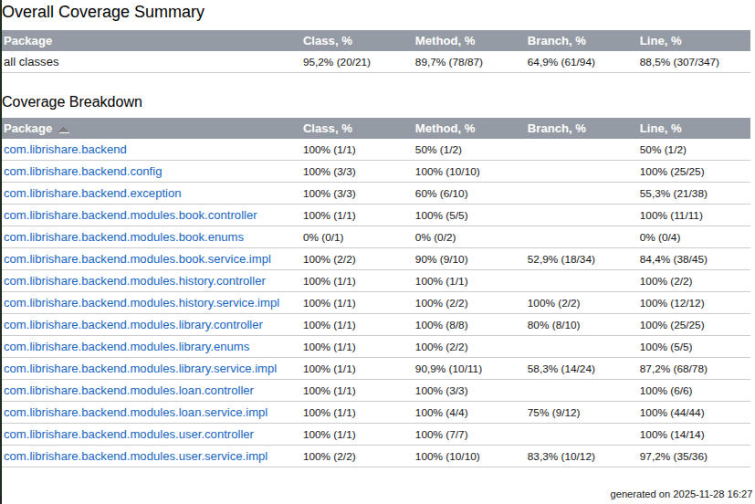

# Arquitetura Back-end

O back-end do LibriShare é uma API RESTful construída em Java com o framework Spring Boot, conectada a um banco de dados PostgreSQL.

## Diagrama de Classes (UML)

O diagrama abaixo ilustra as principais entidades do sistema e seus relacionamentos:

<b>Figura 1</b> - Diagrama de Classes de Domínio Fonte: Autoria própria (2025)

### Entidades Principais

* **User:** Representa o usuário da plataforma. Contém informações pessoais (nome, email, hash da senha) e preferências (meta de leitura anual). O usuário é o ponto central que possui uma biblioteca (`UserBook`) e gera histórico (`UserHistory`).
* **Book:** A entidade de livro "global", contendo dados imutáveis da obra como título, autor, ISBN, editora e capa. Serve de referência para evitar duplicação de dados.
* **UserBook:** A classe associativa que representa "um livro na estante de um usuário". Armazena dados personalizados como status de leitura (`ReadingStatus`), avaliação (estrelas), resenha pessoal e progresso (página atual).
* **Loan:** Gerencia o empréstimo de livros físicos. Vincula um item da estante (`UserBook`) a um mutuário externo (amigo), controlando datas de saída e previsão de devolução.
* **UserHistory:** Registra a trilha de auditoria e atividades do usuário, como "Finalizou um livro" ou "Adicionou uma nova obra", permitindo a exibição de uma linha do tempo no perfil.

---

## Documentação da API (Swagger)

A API segue a especificação OpenAPI, facilitando a integração com o front-end e a testabilidade.

* 🔗 **Acesso Online:** [Swagger UI - LibriShare API (Render)](https://librishare-api.onrender.com/swagger-ui/index.html#/)

Abaixo, a interface visual listando os endpoints disponíveis no ambiente de produção.

<b>Figura 2</b> - Interface do Swagger UI Fonte: Autoria própria (2025)

---

## Qualidade de Software e Testes

Abaixo apresentamos a evidência da execução dos testes automatizados (Unitários e de Integração), garantindo a corretude das regras de negócio descritas acima.

<b>Figura 3</b> - Suíte de testes (Green Bar) Fonte: Autoria própria (2025)

---

## Tecnologias e Padrões

* **Framework:** Spring Boot 3 (Web, Data JPA, Security).
* **Gerenciamento de Dados:** Spring Data JPA com Hibernate.
* **Migrations:** Flyway para versionamento de banco de dados.
* **Segurança:** Spring Security com autenticação Stateless via JWT.
* **Testes:** JUnit 5 e Mockito.