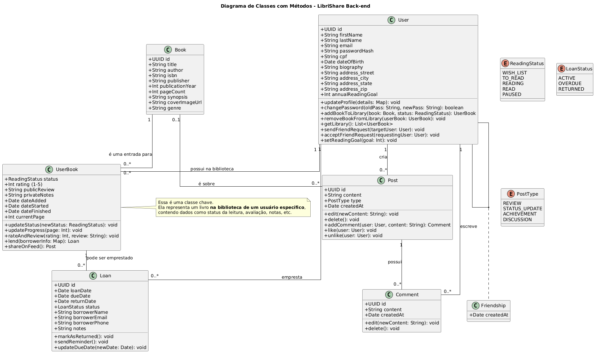

# Arquitetura Back-end

O back-end do LibriShare é uma API RESTful construída em Java com o framework Spring Boot, conectada a um banco de dados PostgreSQL.

## Diagrama de Classes (UML)

O diagrama abaixo ilustra as principais entidades do sistema e seus relacionamentos:

Fonte: Autoria própria (2025)

### Entidades Principais

* **User:** Representa o usuário da plataforma. Contém informações pessoais (nome, email, hash da senha) e de endereço (para empréstimos). O usuário `cria` Posts e `possui na biblioteca` UserBooks.
* **Book:** A entidade de livro "global", com dados imutáveis como título, autor, ISBN, etc..
* **UserBook:** A classe chave que representa "um livro na biblioteca de um usuário específico". É aqui que são armazenados os dados de leitura do usuário, como status (`ReadingStatus`), notas privadas, avaliação e progresso (página atual).
* **Loan:** Representa um empréstimo. Está associado a um `UserBook` (o que foi emprestado) e a um `User` (quem emprestou). Contém dados como o nome do mutuário e as datas de empréstimo/devolução.
* **Post / Comment:** Entidades que alimentam o lado social (LibriConnect). Um `User` `cria` um `Post` (que pode ser uma `REVIEW`, `STATUS_UPDATE`, etc.) e outros usuários podem `escrever` `Comments`.

---

## Documentação da API (Swagger)

A API segue a especificação OpenAPI, facilitando a integração com o front-end e testabilidade. Abaixo, a interface do Swagger UI listando os endpoints disponíveis.

> **[INSIRA AQUI O PRINT DA TELA DO SWAGGER]**
>
> *Legenda: Visualização dos endpoints e contratos de dados da API.*

---

## Qualidade de Software e Testes

Abaixo apresentamos a evidência da execução dos testes automatizados (Unitários e de Integração), garantindo a corretude das regras de negócio descritas acima.

> **[INSIRA AQUI O PRINT DO RESULTADO DOS TESTES (GREEN BAR)]**
>
> *Legenda: Suíte de testes executada com sucesso via JUnit 5.*

---

## Tecnologias e Padrões

* **Framework:** Spring Boot 3 (Web, Data JPA, Security).
* **Gerenciamento de Dados:** Spring Data JPA com Hibernate.
* **Migrations:** Flyway para versionamento de banco de dados.
* **Segurança:** Spring Security com autenticação Stateless via JWT.
* **Testes:** JUnit 5 e Mockito.